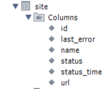
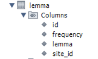

#_ <u>SearchEngine</u> _
***
##_ Описание проекта_
#### Данный проект является реализацией поискового движка с возможностью индексации сайтов и добавления полученной информации в соответствующие базы данных.
***
***
##_ Структура базы данных_
#### Приложение работает с базой данных MySQL, в которой имеются следующие таблицы:
***
###Site

####В таблице присутствует информация об адресе сайта, его названии, статусе, времени последнего обновления и, если есть, о последней ошибке.
***
###Page

####В таблице имеются следующие поля: uri, код ответа, html-код страницы и id сайта.
***
###Lemma

####В таблице указана информация о лемме (основной форме слова, встречающегося на страницах), сайте, на котором эта лемма была найдена и частоте(на скольких страницах это слово было найдено).
***
###Searching_index

####Таблица для связки таблиц page и lemma.
***
***
##_Интерфейс и функционал_
###Dashboard

####Главная страница проекта, открывающаяся по умолчанию. Здесь указана информация по индексации всех сайтов, указанных в файле конфигурации приложения properties.yaml, а так же детальная статистика по каждому сайту.
***
###Management

####Страница, на которой находятся инструменты управления поисковым движком. При нажатии на кнопку "START INDEXING" происходит индексация сайтов, указанных в файле конфигурации приложения:
1. ####Удаление всех данных из таблиц.
2. ####Добавление данных о сайтах в таблицу site с установкой им статуса "INDEXING".
3. ####Добавление данных в таблицы page, lemma и searching_index в многопоточном режиме.
4. ####Если во время индексации повторно нажать кнопку "START INDEXING", в интерфейс будет выведено сообщение, информирующее, что индексация уже запущена.
####Так же, на странице имеется функция индексации отдельной страницы. В случае, если страница находится за пределами сайтов, прописанных в конфигурационном файле, указывается соответственное сообщение.
***
###Search

####Страница поиска. В строку можно вводить как одно слово, так и целую фразу. Приложение выведет ссылки на страницы, в которых имеются совпадения по поисковому запросу с учетом склонений.
####Приложение дает возможность производить поиск как по всем сайтам из файла конфигурации, так и по выбранному. В случаях, если поисковый запрос пуст или совпадения были не найдены, будет выведено соответствующее сообщение.
***
***
##_Стек используемых технологий_
* ####Java Core
* ####Spring Boot
* ####JPA
* ####Hibernate
* ####JDBC
* ####REST API
* ####JSOUP
* ####Maven
* ####Git
* ####Apache lucene morphology (Библиотека для работы с лексическими формами).
***
***
##_Запуск приложения_
####Приложение доступно по адресу: http://localhost:8080/

